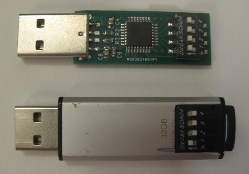
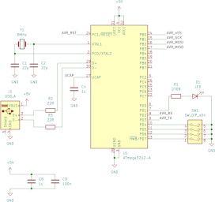
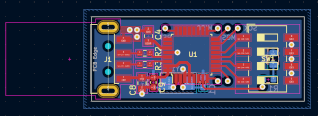

### Password typist

[](images/IMG_2420.jpg)

When plugged into a USB port, this little gadget will present itself
as a keyboard and type out a preprogrammed password. Up to 14 passwords
can be stored and up to 32 characters long each. Which password
is typed out is selectable by a DIP switch. Addresses 0 and 15
are special. Address 0 (all off) is used to program passwords into the device.
When selected, the gadget will present itself as a serial device rather
than a keyboard and allow you to program the passwords using commands
described below. Address 15 (all on) is a panic address - on powerup,
the device will immediately erase all passwords stored on it.

Compiling the project requires the [LUFA library](https://www.fourwalledcubicle.com/LUFA.php).

**Warning:** While this device enables you store strong passwords you couldn't 
normally remember, it should be obvious that physical possession of the device
equals having access to all passwords. There is no PIN or similar access
restriction mechanism. Losing the device in a random place might
not be an immediate security breach as there is no information linking the
passwords to where they are used. Leaving the device on a table next to
a computer where it is used however is. It is up to you to evaluate whether this
is acceptable for you or not.

#### Programming the passwords

Select address 0 (all off) and plug in the device. A serial port should appear
on your computer.

Command | Description
--------|------------
p#=...  | program password #, where # is a lowercase hex digit 1..9a..f
l#?     | display password #
c!      | clear passwords

Examples:

```
p3=mypassword3 (program password 3)
sto (device reply)

pb=mypassword11 (program password 11)
sto (device reply)

l5? (show stored password 5)
mypassword5

c! (clear passwords)
clr (device reply)
```

Allowed password characters are a..z, A..Z, 0..9, and a bunch of special character.
Take a look at c2ksc() function in k_main.c to see a full list.

There is a slight complication however. How keyboard scan codes are interpreted depends
on the keyboard layout you have set. Since my keyboard layout is Slovenian, the c2ksc()
function is written to emulate that. For example, to get the @ character on my keyboard
AltGr-V have to be pressed. It's unlikely your keyboard layout is the same, so there
are a few things you can do:

- Fix c2ksc() to correspond to your keyboard layout.
- Use only alphanumeric characters, since it's the special characters that are most problematic. Remain aware of qwerty-qwertz-azerty thing though.
- Test which special characters work, which change to something else and which don't work at all. Modify your passwords accordingly.

#### Using the gadget

Select a password number using the DIP switches. Plug the gadget into the computer.
After a second, the selected password is typed out. You can unplug the gadget at this point.
Press enter to confirm the password. You can increase the security somewhat by manually
typing additional character before and/or after using the gadget. This way, a part of
the password is provided by you and a part by the gadget (something you know + something you have paradigm).

#### Bill of materials

Before making my own board I used DFRobot Beetle. With minor changes to the
code (device = atmega32u4 and pin definitions), you can use it too.

[](images/avrkeypass_sch.png)
[](images/avrkeypass_brd.png)

Qty | Value | Device       | Size   | Parts
--|---------|--------------|--------|-------
1 |         | ATmega32u2   | TQFP32 | U1
1 | 270R    | resistor     | 0603   | R1
2 | 22R     | resistor     | 0603   | R2,R3
1 | red     | chipled      | 0805   | D1
1 | 100n    | multilayer   | 0603   | C9
2 | 1u      | multilayer   | 0805   | C4,C8
2 | 22p     | multilayer   | 0603   | C1, C2
1 | 8MHz    | crystal      | ABM3   | Y1
1 | 4 pos   | DIP switch   |        | SW1
